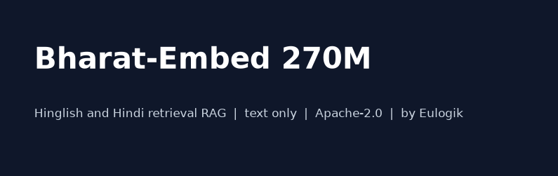

# Bharat-Embed 270M

[](LICENSE)




Text only EmbeddingGemma-2 fork for **Hinglish and Hindi retrieval RAG**. Built on a Mac mini M4 by [Eulogik](https://github.com/eulogik). Apache-2.0.

## What it is

| Piece | Status |
|---|---|
| Indic retrieval weights (270M, MRL 128) | Trained, loss 0.586 to 0.236, [on HF](https://huggingface.co/eulogik/bharat-embed-270m-gemma2) |
| ONNX INT8 edge pack | Exported, parity drift 0.0066 |
| Legal adapter (DIFC, GST, VAT) | Trained, loss 0.689 |
| GGUF quants | Next |
| MTEB Hindi retrieval | +0.0045 over base, reported plainly |

## Quickstart

```python
from sentence_transformers import SentenceTransformer

model = SentenceTransformer(
    "eulogik/bharat-embed-270m-gemma2",
    config_kwargs={"vision_config": None, "audio_config": None},
    model_kwargs={"torch_dtype": "bfloat16"},
)
q = model.encode("GST refund kaise claim karein?", prompt_name="SearchQuery",
                 truncate_dim=128, normalize_embeddings=True)
```

Full snippets in [USAGE.md](USAGE.md). Model card with measured tables in [cards/MAIN_MODEL_CARD.md](cards/MAIN_MODEL_CARD.md).

## Repo layout

- `src/embed` train, export, shared prefix helpers
- `scripts` triplet prep, eval, parity, charts, HF push
- `tests` prefix plus ship gates (12 green)
- `eval/README.md` pre-registered gates, locked before run one
- `cards` model, adapter, dataset cards plus collection
- `spaces` search plus webgpu demos
- `assets` hero, architecture, truncation chart

## Honest numbers

Hindi IndicQA NDCG@10: base 0.7279, ours 0.7324. STS tie. The +0.03 stretch gate was missed and is stated as missed. v1.1 retrains on diverse real Hindi.

## Eulogik family

- Reranker: [flashrank-pro-base](https://huggingface.co/eulogik/flashrank-pro-base)
- HF org: [huggingface.co/eulogik](https://huggingface.co/eulogik)
- Code org: [github.com/eulogik](https://github.com/eulogik)

License Apache-2.0. Base `google/embeddinggemma-2`.
